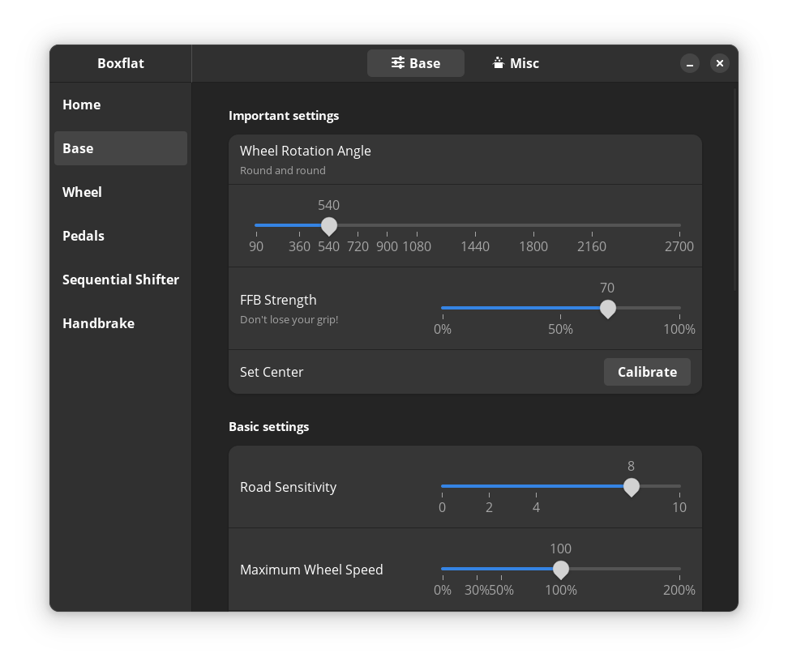
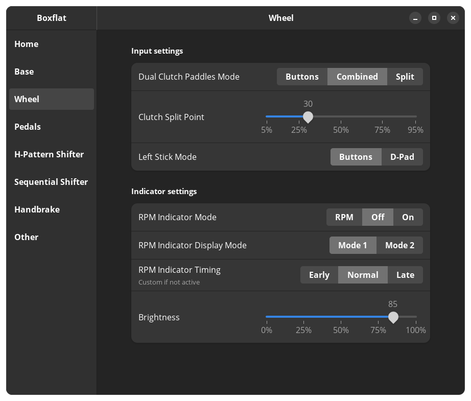
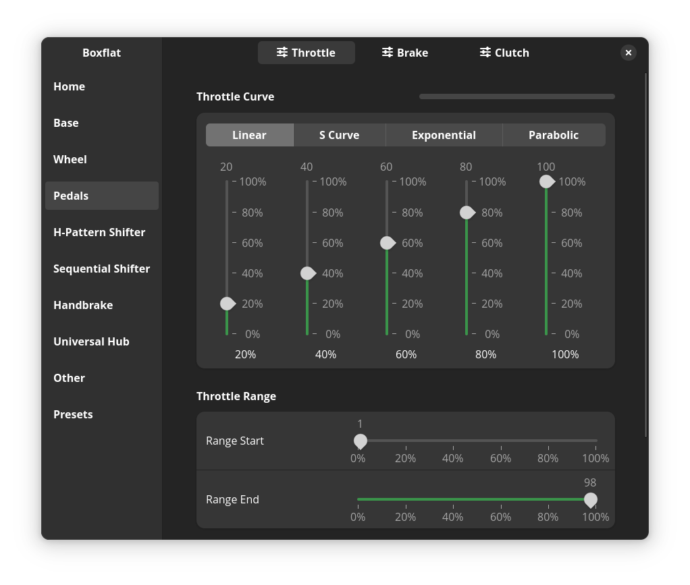
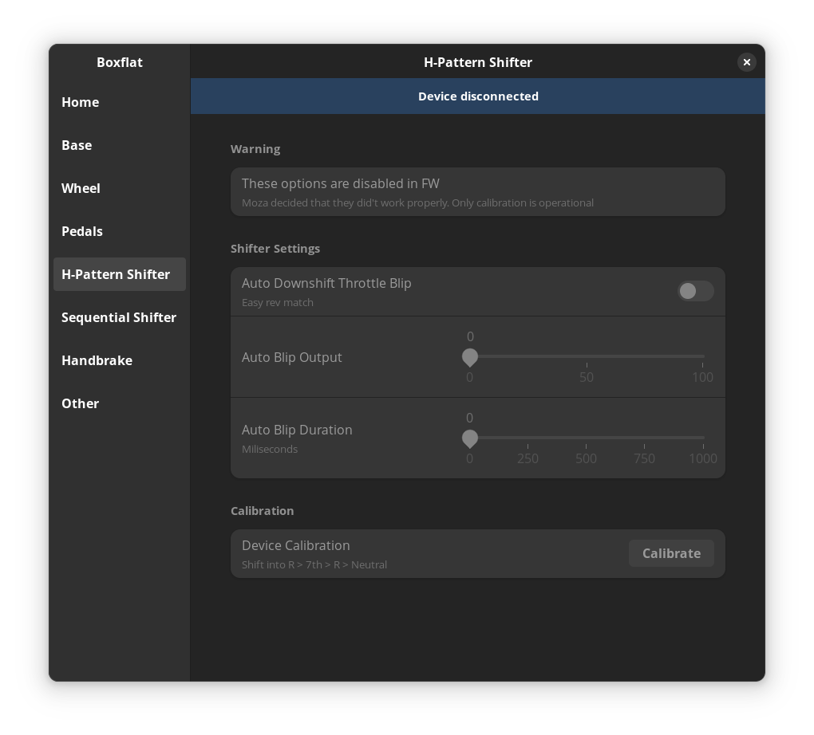
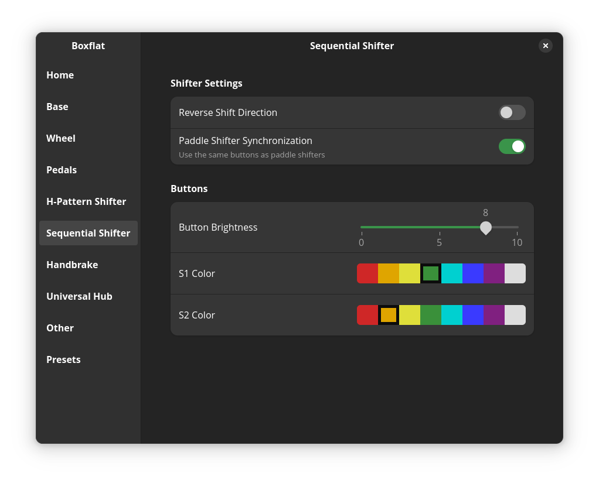
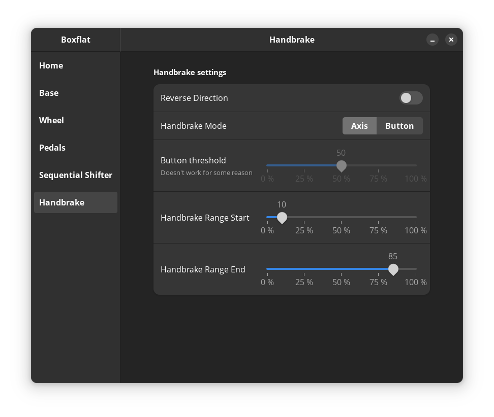

# Boxflat
Boxflat for Moza Racing. Control your Moza gear settings!



<a href="https://flathub.org/apps/io.github.lawstorant.boxflat">
    
</a>

#### For moza ffb driver, check out [universal-pidff](https://github.com/JacKeTUs/universal-pidff) by [@JacKeTUs](https://github.com/JacKeTUs)
#### For more information about the Moza Racing serial protocol see [Moza serial protocol](./moza-protocol.md) page

## Functionality

| Device         | Completeness | WIP |
| :------------: | :----------: | :-- |
| Home page      | 0%           | Quick settings |
| Base           | 100%         | |
| Wheel          | 100%         | |
| Pedals         | 100%         | |
| Dashboard      | 0%           | Dashboard settings |
| Hub            | 0%           | Rows with connection status |
| H-Pattern      | 100%         | |
| Sequential     | 100%         | |
| Handbrake      | 100%         | |
| Other settings | 100%         | |

### WiP
- Rotation output
- Showing only settings that are relevant to the connected hardware (differing wheel settings)

### Firmware upgrades
There are some EEPROM functions available, but I need to do more testing to make sure I won't brick anything. For now, just use Pit House on Windows if you can, as FW upgrade support is not coming in the near future.

## Compatibility
Moza commands and their protocol is hardware agnostic, so any implemented feature should work with any wheelbase, wheel, pedal set etc. Some Wheel settings are device-specific (FSR Wheel dashboard for example)

# Installation
## Flatpak
Boxflat is available on **[Flathub](https://flathub.org/apps/io.github.lawstorant.boxflat)**

### Udev rule installation for flatpak
Copy this into terminal and execute with root permissions
```bash
sudo tee /etc/udev/rules.d/99-boxflat.rules <<< 'SUBSYSTEM=="tty", KERNEL=="ttyACM*", ATTRS{idVendor}=="346e", ACTION=="add", MODE="0666", TAG+="uaccess"'
```
Unplug and plug in your deivce to trigger this new rules. Alternatively, you can reboot your system.

## Arch Linux:
https://aur.archlinux.org/packages/boxflat-git

## Manual:
This package depends on:
- python3
- gtk4
- libadwaita ~>1.3
- pyyaml ~>6.0.1
- pyserial ~>3.5
- pycairo ~>1.26.1
- PyGObject ~>3.48.2

```bash
# Just run:
$ ./entrypoint.py --local
# or
$ python3 entrypoint.py --local

# use `--dry-run` argument to disable serial communication
$ ./entrypoint --local --dry-run
```
Installation:
```bash
# Run `install.sh` with root permissions.
$ sudo ./install.sh
# Application will be installed as `boxflat`
$ boxflat
```
Removal:
```bash
# Run `install.sh remove` with root permissions.
$ sudo ./install.sh remove
```

# Some more early screenshots









