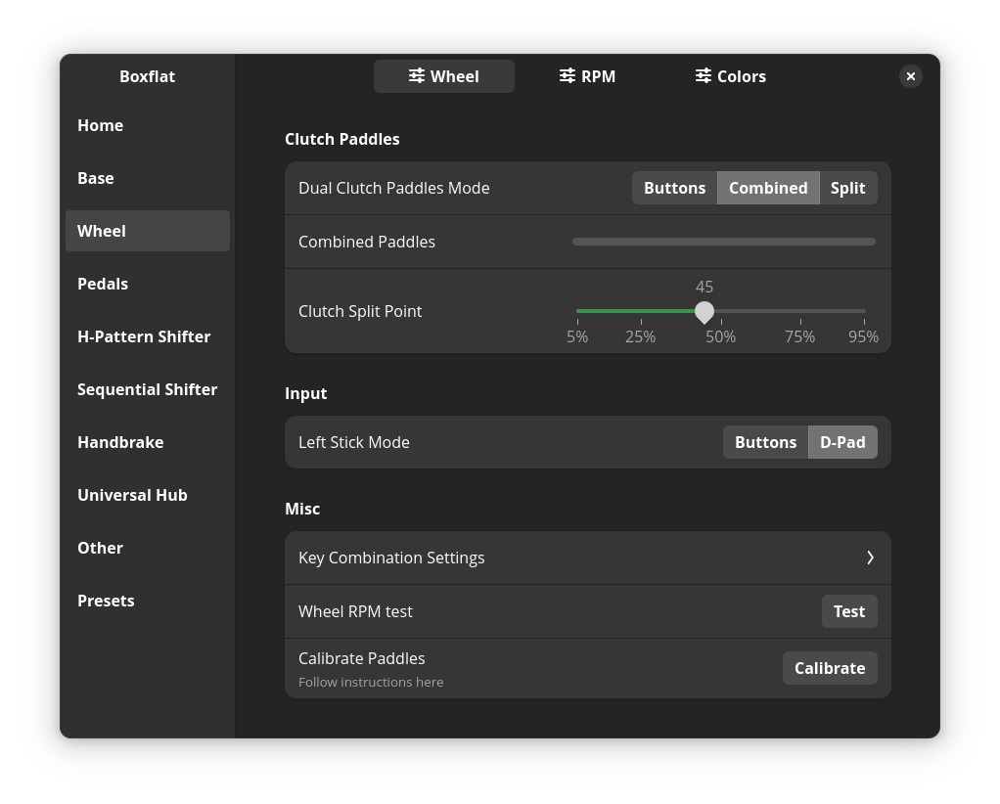

# boxflat
Boxflat for Moza Racing. Control your Moza wheelbase settings!


This is still work in progress, but I managed to hook up to the serial connection and a few settings are already functional.

#### For moza ffb driver, check out [moza-ff](https://github.com/JacKeTUs/moza-ff) by [@JacKeTUs](https://github.com/JacKeTUs)
#### For more information about the Moza Racing serial protocol see [Moza serial protocol](./moza-protocol.md) page

## Functionality

| Device | Completness | WIP |
| :-: | :-: | :- |
| Home page | 0% | Base and pedals output, Quick settings |
| Base | 80% | Equalizer, FFB Curve |
| Wheel | 50% | RPM colors, anything not present on RSv2 |
| Pedals | 80% | Output curves, calibration |
| Dashboard | 0% | |
| Hub | 0% | Rows with connection status |
| H-Pattern | 90% | Calibration |
| Sequential | 100% | |
| Handbrake | 70% | Output curve, Calibration |
| Other settings | 0% | Bluetooth switch, FH5 compat mode |

### WiP
- udev rules for serial ports
- Calibration warning dialog
- Device discovery (currently defaulting to `/dev/ttyACM0`)
- USB/Wheelbase accessory connection discovery
- Reading settings from the base :P
- Showing only settings that are relevant to connected hardware

### Firmware upgrades
There are some EEPROM functions available, but I need to do more testing to make sure I won't brick anything. For now, just use Pit House on Windows if you can, as FW upgrade support is not coming in the near future.

## Compatibility
Moza commands and their protocol is hardware agnostic, so any implemented feature should work with any wheelbase, wheel, pedal set etc. Some Wheel settings are device-specific (FSR Wheel dashboard for example)

## Installation/dependencies
This package depends on:
- python3
- gtk4
- libadwaita ~>1.3
- pyyaml ~>6.0.1
- pyserial ~>3.5
- pycairo ~>1.26.1
- PyGObject ~>3.48.2

### Arch Linux:
https://aur.archlinux.org/packages/boxflat-git

### Manual:
```bash
# Just run:
$ ./entrypoint.py --local
# or
$ python3 entrypoint.py --local

# use `--dry-run` argument to disable serial communication
$ ./entrypoint --local --dry-run
```
Installation:
```bash
# Run `install.sh` with root permissions.
$ sudo ./install.sh
# Application will be installed as `boxflat`
$ boxflat
```
Removal:
```bash
# Run `install.sh remove` with root permissions.
$ sudo ./install.sh remove
```

# Some more early screenshots




