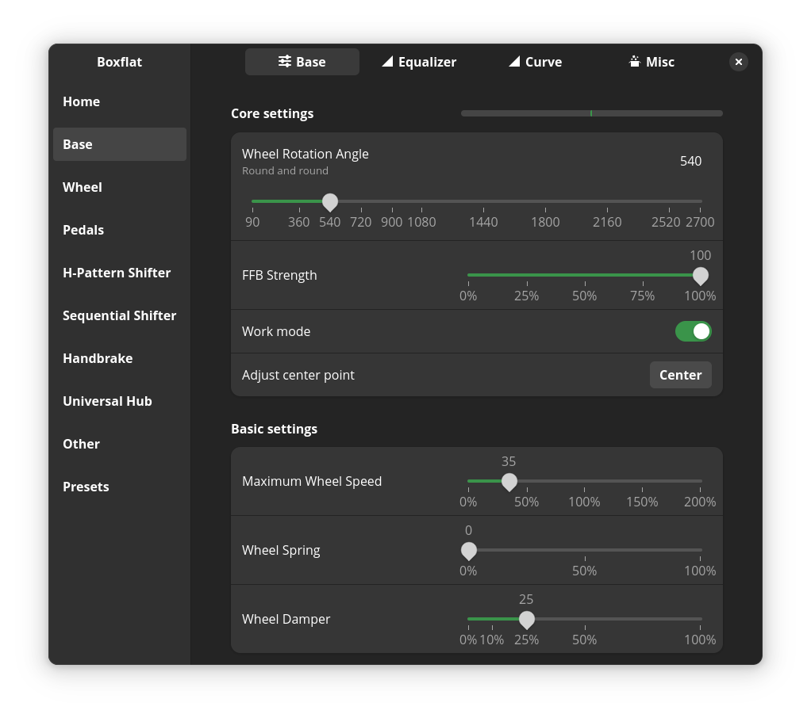
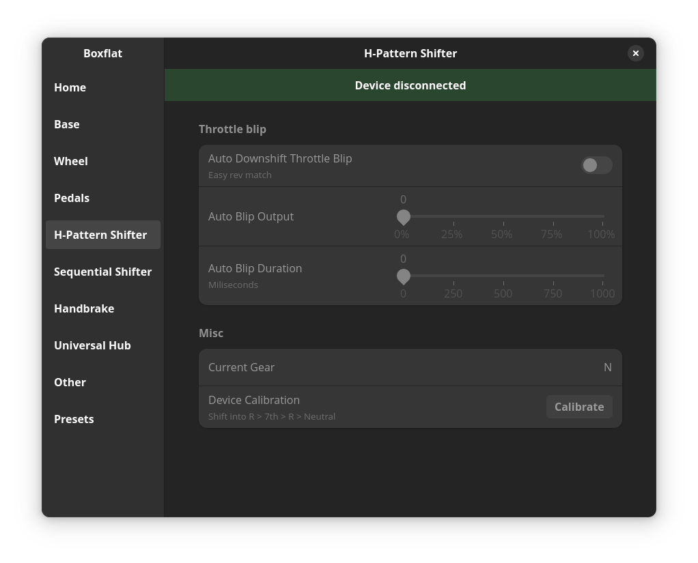

# Boxflat
Boxflat for Moza Racing. Control your Moza gear settings... and more!



<a href="https://flathub.org/apps/io.github.lawstorant.boxflat">
    
</a>

> [!NOTE]
> [Sim Racing On Linux](https://simracingonlinux.com/)

> [!WARNING]
>For moza ffb driver, check out [universal-pidff](https://github.com/JacKeTUs/universal-pidff) by [@JacKeTUs](https://github.com/JacKeTUs)
>
>Not needed for 6.15+ as it was upstreamed and backported to 6.14.3, 6.13.12, 6.12.24.

> [!TIP]
> For more information about the Moza Racing serial protocol see [Moza serial protocol](./moza-protocol.md) page

## Functionality

| Device          | Completeness  | WIP |
| :-------------: | :-----------: | :-- |
| Home page       | 100%          | |
| Base            | 100%          | |
| Wheel           | 100%          | |
| Pedals          | 100%          | |
| Dashboard       | LED control   | Display Settings |
| Universal Hub   | 100%          | |
| H-Pattern       | 100%          | |
| Sequential      | 100%          | |
| Handbrake       | 100%          | |
| E-Stop          | 100%          | |
| Stalks          | 100%          | |
| Other settings  | 100%          | |
| Presets         | 100%          | |
| Generic devices | Detection fix | |

### Ideas
- Telemetry ingestion through REST API/WebSockets
- Cammus support
- PXN Support
- Simagic support
- H-Pattern and Sequential settings available for arbitrary HID devices

### Firmware upgrades
There are some EEPROM functions available, but I need to do more testing to make sure I won't brick anything. For now, just use Pit House on Windows if you can, as FW upgrade support is not coming in the near future.

## Compatibility
Moza commands and their protocol is hardware agnostic, so any implemented feature should work with any wheelbase, wheel, pedal set etc. Some Wheel settings are device-specific (FSR Wheel dashboard for example)

Wheel indicator blinking colors can't be read from the wheel. This is a limitation of the current firmware.

Boxflat automatically detects is a device (shifter/pedals) needs a detection fix and creates a proper virutal device. This fixes game detection.

> [!TIP]
> Detection fix can be applied to any HID device as well (pedals, shifters, button boxes).

# Installation
## Flatpak (preferred method)
Boxflat is available on **[Flathub](https://flathub.org/apps/io.github.lawstorant.boxflat)**

### Udev rule installation for flatpak
Copy this into terminal and execute with root permissions
```bash
sudo tee /etc/udev/rules.d/99-boxflat.rules <<< 'SUBSYSTEM=="tty", KERNEL=="ttyACM*", ATTRS{idVendor}=="346e", ACTION=="add", MODE="0666", TAG+="uaccess"'
```

> [!IMPORTANT]
> Unplug and plug in your deivce to trigger these new rules. Alternatively, you can reboot your system.

## Arch Linux:
https://aur.archlinux.org/packages/boxflat-git

## Void Linux:
`xbps-install -S boxflat`

## Manual:
This package depends on:
- python >= 3.11
- gtk4
- libadwaita >= 1.6
- cairo 1.18
- gobject-introspection
- pkexec (optional)

Python dependencies:
- pyyaml 6.0.2
- psutil 6.1.0
- pyserial 3.5
- pycairo 1.27.0
- PyGObject 3.50.0
- evdev 1.7.1


```bash
# Just run:
$ ./entrypoint.py --local
# or
$ python3 entrypoint.py --local
```
Installation:
```bash
# Run `install.sh` with root permissions.
$ sudo ./install.sh
# Application will be installed as `boxflat`
$ boxflat
```
Removal:
```bash
# Run `install.sh remove` with root permissions.
$ sudo ./install.sh remove
```

# Troubleshooting
Below are some common problems and possible solutions:
- `Error getting authority` when adding/updating the udev rules: make sure
  the `dbus` service is running
- Wheelbase does not appear, `dmesg` shows it connecting and getting assigned
  an USB device, but it doesn't show up in boxflat -- check the `/dev` folder
  with `ls /dev/ttyACM*`, if there is nothing you might be missing the
  `CDC ACM` serial driver in the kernel
- There is no FFB - if your torque is up to 100%, try turning it down to 95%
  and turn the wheelbase off and on again

# Some more screenshots





## Supporters
I give my heartfelt THANK YOU to every supporter who felt like this was worth a little to spare. Special thanks go to:
- [@abowen](https://github.com/abowen)
- [@SkaterPaul](https://github.com/SkaterPaul)
- [@m4tx](https://github.com/m4tx)
- [@TylerCode](https://github.com/TylerCode)
- [@Petjes-je](https://github.com/Petjes-je)

**© 2025 Tomasz Pakuła Using Arch BTW**
